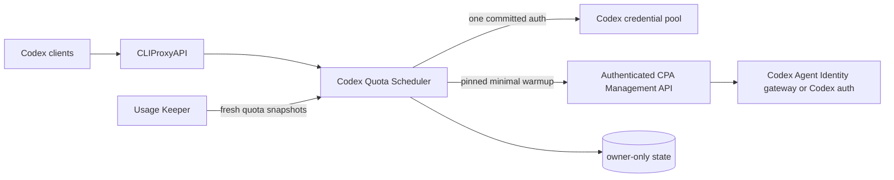

<div align="center">
  
  <h1>Codex Quota Scheduler</h1>
  <p><strong>CPA-native one-account-at-a-time scheduling, 5h/weekly quota balancing, persistent 429 quarantine, and safe full-quota activation.</strong></p>
  <p>
    <a href="https://github.com/simplez2/cpa-codex-quota-scheduler/actions/workflows/ci.yml"></a>
    <a href="https://github.com/simplez2/cpa-codex-quota-scheduler/releases"></a>
    <a href="LICENSE"></a>
    
    
  </p>
</div>

> **Version note:** the source and registry declare plugin version **v0.1.26**. A build is a published release only after the matching `v0.1.26` tag and release assets are available.

> **Upgrade exception:** the first upgrade from **v0.1.19 or earlier** to **v0.1.20** changes the generation-lock protocol and requires one controlled quick restart of CPA. Do not hot-load old and new DSOs together. Later v0.1.20-compatible reloads use the stable lock protocol normally.

The plugin keeps normal Codex traffic on one globally committed credential. It switches only when quota policy, an authoritative 429, quarantine, or confirmed candidate loss requires it. Fully available accounts can be activated separately, one at a time, without turning normal traffic into round-robin usage.

## Why this exists

| Requirement | Behavior |
|---|---|
| Lower account-risk exposure | One committed account serves normal traffic until a real switch trigger occurs. |
| Spend short cycles before long cycles | Default class order is **5h -> weekly -> monthly**. |
| Avoid wasting reset credits | Within a class, reset-credit accounts can be preferred before active-cycle and usage concentration tie-breakers. |
| Survive transient 408/5xx suppression | CPA candidate loss first becomes a request-local provisional fallback, not an immediate permanent switch. |
| Recover safely after 429 | Durable cooldown, one global half-open probe, then healthy or probation. |
| Start dormant full-quota cycles | Strictly sequential, pinned, minimal Responses requests; normal routing remains serial. |
| Handle platform-wide early resets | Two independent fresh Keeper observations are required before a stale quota ban is cleared. |
| Hot-reload safely | Generation ownership and cross-process warmup leases stop superseded plugin instances from continuing work. |
| Operate from CPA Management | Change mode, threshold, warmup model, or the serial primary through authenticated hot configuration. |

## Architecture



The scheduler never rewrites models, credentials, provider definitions, or third-party routes. It only returns an auth choice for a pure `codex` candidate set. Management responses are authenticated but may contain operational auth identifiers, so they must not be pasted into public issues without redaction.

## Selection and switching

Normal traffic still has exactly one committed global primary; this is not request-level round-robin. When an initial selection or committed switch is required, the scheduler applies these rules:

1. keep accounts below `reserve_weekly_percent` in a protected partition while any unprotected account exists;
2. honor end-of-cycle drain and `window_order`;
3. prefer reset-credit accounts when configured;
4. preserve the historical CPA priority/fill-first rule only for the first cold-start selection;
5. after the pool has selection history, group weekly remaining capacity by `switch_hysteresis_percent`;
6. inside the best weekly band, prefer the least-used 5h window;
7. use the longest-idle selection timestamp, CPA priority, and stable auth ID as deterministic tie-breakers.

A healthy primary remains committed between switch boundaries. It can be preempted when a higher-priority window becomes usable, when its weekly capacity enters the protected reserve while a safe backup exists, or once at a verified new 5h cycle boundary in automatic mode. Hard limits, `allowed=false`, 429, quarantine, and confirmed candidate loss always remain failover signals. If the primary is hard-limited and every backup has only crossed the soft threshold, the scheduler explicitly selects the best soft-threshold backup rather than delegating an unsafe choice back to CPA.

### End-of-cycle drain

Drain duration is capped at the smaller of `drain_window_hours` and the final 10% of the quota window. With defaults, a 5h window drains only during its final 30 minutes, while weekly and monthly windows keep the six-hour cap. Drain may cross the soft threshold, but never overrides `limit_reached`, `allowed=false`, quarantine, or 429.

### In-flight overdraft (session pinning)

When CPA supplies a stable session identifier, serial mode records which auth already served that conversation. After a global threshold or hard-limit switch, only that pre-existing conversation may continue on its prior auth; a newly observed session is never bound to an already exhausted primary. Bindings use a 30-minute sliding inactivity TTL, persist across restarts, and are removed if the auth disappears or becomes quarantined. This is a bounded compatibility mechanism for observed upstream continuation behavior, not a promise about future quota or billing semantics. Runtime status exposes the live count as `serial_overdraft_sessions`.

## Warmup in one paragraph

A normal warmup candidate must have a fresh Keeper row, all recognized windows at 0% used and allowed, explicit zero usage credits, a credible “not started” reset signal, a valid CPA auth binding, no active/pending/blocked warmup record, and no competing generation or instance lease. An expired authoritative quota cooldown is the only quarantine exception: when the same strict full-zero snapshot is present, the one pinned minimal `hello` request becomes the credential's serialized half-open recovery probe. The cooldown's `BannedAt` and exact probe-start identity are checked again before dispatch and again when a retiring generation reports its result. A newer 429, another probe, or a changed binding cancels the request. Success clears only the matching old cooldown; 429 or transport failure creates the appropriate cooldown, and no request is repeated during hot takeover. Cyber-policy, abuse, auth, deactivated-workspace, and similar terminal failures are stored only as redacted blocked codes and are never retried automatically.

Completed HTTP failures, including 502/503 and HTTP 200 streams that end in an error event, keep their original `AttemptedAt` backoff across plugin generations. Only a genuinely unfinished attempt with no upstream status, or a lifecycle cancellation before any result, may resume immediately after hot reload.

Keeper keeps disabled credentials in its usage history. The scheduler excludes those rows from cache requests and snapshots, then intersects every side-effecting `/quota/refresh` target with CPA's current active Codex auth inventory. If that authenticated inventory is unavailable, cached quota data remains readable but the refresh request fails closed. The filter accepts both official OAuth and Agent Identity/PAT credentials and never consumes a reset credit.

Platform-wide resets are reconciled without trusting one transient quota row. Two strictly newer Keeper observations must independently prove the new cycle before an obsolete quota cooldown is removed. This also repairs historical cooldowns whose persisted `5h` label conflicts with their recorded weekly or monthly span, including a later weekly-only Team plan shape. Once confirmed, the stale warmup record is cleared and that same fresh snapshot may become a warmup candidate in the current refresh cycle.

See [Runtime logic](RUNTIME_LOGIC.zh-CN.md) for the complete state machine and [Operations handoff](HANDOFF.zh-CN.md) for deployment and incident procedures.

## Recommended configuration

Start from [SERIAL_CONFIG.example.yaml](SERIAL_CONFIG.example.yaml):

```yaml
plugins:
  enabled: true
  configs:
    codex-quota-scheduler:
      enabled: true
      priority: 2000
      scheduler_mode: serial
      serial_switch_percent: 98
      serial_handoff_mode: threshold_only # or reserve_aware
      serial_5h_handoff_mode: inherit_global # custom_threshold, reserve_aware, 429_only
      serial_5h_switch_percent: 98
      serial_prefer_active_cycle: true

      keeper_url: http://cpa-usage-keeper:8080/keeper
      keeper_password_file: /run/secrets/keeper_login_password
      refresh_interval: 30s
      stale_after: 15m
      state_path: /var/lib/codex-quota-scheduler/state.json

      reserve_5h_percent: 15

      prefer_reset_credits: true
      window_order: [5h, weekly, monthly]

      warmup_enabled: true
      warmup_execution_mode: management
      warmup_model: gpt-5.6-luna
      warmup_sidecar_url: http://codex-agent-identity-gateway:8787/backend-api/codex
      warmup_retry_after: 15m
      cpa_management_url: http://127.0.0.1:8317/v0/management/api-call
      cpa_management_key_file: /run/secrets/management_key
```

`serial_handoff_mode` is user-selectable in CPA Management. `threshold_only`
preserves the legacy behavior and switches at `serial_switch_percent`.
`reserve_aware` also treats the configured reserve for the active window as an
early handoff boundary: `reserve_5h_percent` for 5h, `reserve_weekly_percent`
for weekly, and `reserve_monthly_percent` for monthly. This keeps the handoff
logic consistent across all recognized Codex windows. Hard limits and 429
quarantine remain authoritative in either mode.

The 5h window also has an explicit override in CPA Management. The default
`serial_5h_handoff_mode: inherit_global` keeps the existing global behavior.
`custom_threshold` uses `serial_5h_switch_percent`, `reserve_aware` uses only
the 5h reserve, and `429_only` disables soft 5h handoff while retaining hard
limit, disallowed, and 429 failover. This lets an operator choose between the
legacy 98% threshold, a custom 5h threshold, a protected reserve, or hard
failover only without changing weekly/monthly policy.

`warmup_model` applies only to the pinned activation request. It does not change CPA's default channel, official model list, or the model used by normal traffic.

## Build and verify

Go 1.23 or newer plus a C compiler is required for the dynamic library:

```bash
gofmt -w .
go test ./...
go test -race ./...
go vet ./...
CGO_ENABLED=1 go build -buildmode=c-shared -o codex-quota-scheduler.so .
```

Copy the library to CPA's platform plugin directory, enable the config, and retain `state_path` on a persistent owner-only volume. Canary-test the exact CPA image before production because the dynamic plugin ABI is tied to the host SDK.

## Authenticated Management API

All routes live below `/v0/management/plugins/codex-quota-scheduler`:

| Method | Route | Purpose |
|---|---|---|
| `GET` | `/quota` | Serial, Keeper, generation, warmup, reconciliation, and authenticated operational status. |
| `PUT` | `/serial-active` | Manually select one active, fresh, eligible serial primary with `{"auth_id":"..."}`. |
| `DELETE` | `/serial-active` | Clear the manual primary and return to automatic selection. |
| `GET` | `/bans` | Current cooldown, probation, and half-open entries. |
| `POST` | `/unban` | Explicitly clear one quarantine entry. |
| `POST` | `/unban-all` | Explicitly clear all quarantine entries. |
| `POST` | `/warmup-retry` | Clear a repaired blocked warmup by auth ID, or explicitly with `all=true`. |

Manual primary selection, unban, and warmup retry are privileged actions. The selected primary remains protected by automatic 429, hard-limit, higher-priority-window, and candidate-loss failover. The plugin intentionally registers no dynamic or privileged `/v0/resource/plugins/...` route.

## Security boundary

- Handles only pure `codex` candidate pools; mixed or third-party sets fall back to CPA.
- Does not modify OAuth, PATs, cookies, auth files, official/default models, or third-party APIs.
- Reads Keeper and CPA Management secrets only from mounted files.
- Persists scheduling metadata, auth identifiers, hashed session identifiers, reset anchors, redacted failure codes, bans, and warmup outcomes — never credential values.
- Treats `cyber_policy` and `cyber_abuse` as terminal blocked results; no retry loop is started.
- Writes state atomically with owner-only permissions and fences hot-reload generations.

Read [SECURITY.md](SECURITY.md) before exposing Management routes.

## Documentation

- [运行逻辑与状态机](RUNTIME_LOGIC.zh-CN.md)
- [生产交接与运维手册](HANDOFF.zh-CN.md)
- [Serial scheduler design](DESIGN_SERIAL_SCHEDULER.md)
- [Example configuration](SERIAL_CONFIG.example.yaml)
- [Security policy](SECURITY.md)

## Compatibility modes and limits

`legacy`, `shadow`, and `enforce` remain for migration. New deployments should use `serial`; it is the only mode that guarantees independent sessions do not intentionally spread normal traffic across the pool.

If every account is hard-exhausted or quarantined, the current CPA scheduler ABI cannot return a hard-denied filtered set. The plugin returns `Handled=false`, and final behavior depends on the CPA host version. A backup that has crossed only the soft threshold is still preferred over a hard-exhausted primary.

## License and provenance

MIT licensed. The project evolved from [ysxk/codex-429-autoban](https://github.com/ysxk/codex-429-autoban) and preserves its copyright and license notices. This repository is an independent integration project and is not an official OpenAI product.
