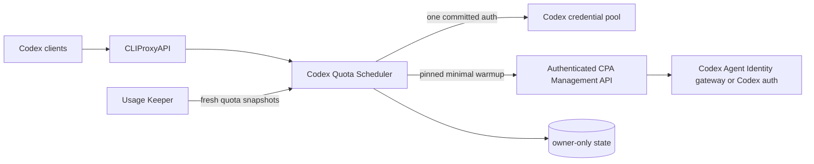

<div align="center">
  
  <h1>Codex Quota Scheduler</h1>
  <p><strong>CPA-native serial fill-first scheduling, persistent 429 quarantine, and safe full-quota activation for Codex account pools.</strong></p>
  <p>
    <a href="https://github.com/simplez2/cpa-codex-quota-scheduler/actions/workflows/ci.yml"></a>
    <a href="https://github.com/simplez2/cpa-codex-quota-scheduler/releases"></a>
    <a href="LICENSE"></a>
    
    
  </p>
</div>

> **Version note:** this feature branch and its registry declare plugin version **v0.1.13**. The newest public GitHub Release may still be **v0.1.0** until the current draft PR is reviewed, merged, tagged, and released. Do not treat a branch build as a published release.

The plugin keeps normal Codex traffic on one globally committed credential. It switches only when quota policy, an authoritative 429, quarantine, or confirmed candidate loss requires it. Fully available accounts can be activated separately, one at a time, without turning normal traffic into round-robin usage.

## Why this exists

| Requirement | Behavior |
|---|---|
| Lower account-risk exposure | One committed account serves normal traffic until a real switch trigger occurs. |
| Spend short cycles before long cycles | Default class order is **5h → weekly → monthly**. |
| Avoid wasting reset credits | Within a class, reset-credit accounts can be preferred before active-cycle and usage concentration tie-breakers. |
| Survive transient 408/5xx suppression | CPA candidate loss first becomes a request-local provisional fallback, not an immediate permanent switch. |
| Recover safely after 429 | Durable cooldown, one global half-open probe, then healthy or probation. |
| Start dormant full-quota cycles | Strictly sequential, pinned, minimal Responses requests; normal routing remains serial. |
| Handle platform-wide early resets | Two independent fresh Keeper observations are required before a stale quota ban is cleared. |
| Hot-reload safely | Generation ownership and cross-process warmup leases stop superseded plugin instances from continuing work. |

## Architecture



The scheduler never rewrites models, credentials, provider definitions, or third-party routes. It only returns an auth choice for a pure `codex` candidate set and exposes redacted diagnostics under CPA's authenticated Management API.

## Selection and switching

When no active auth is committed, or a real switch is required, healthy candidates are sorted by:

1. `window_order` — default `5h`, `weekly`, `monthly`;
2. known Keeper class before unknown class;
3. reset-credit availability when `prefer_reset_credits` is enabled;
4. already-started cycle when `serial_prefer_active_cycle` is enabled;
5. higher used percentage to concentrate consumption;
6. CPA priority and stable auth ID.

Once selected, a more attractive backup does **not** preempt the active auth. A switch occurs only when an active window reaches `serial_switch_percent`, becomes disallowed/exhausted, receives a qualifying 429, is quarantined, or remains absent from CPA candidates for at least 90 seconds and three confirmations.

### End-of-cycle drain

When a usable window is within `drain_window_hours` (default 6h, 0 disables) of its reset, that account enters drain mode: it may run past `serial_switch_percent` until Keeper reports the window as fully consumed, and drain accounts are preferred over fresh backups so expiring quota is used before it resets. This mirrors the official courtesy behavior where an in-flight session continues to completion after the usage limit is hit without extra charge; new requests are only blocked once the window is truly exhausted.

### In-flight overdraft (session pinning)

Serial mode pins every active conversation to the auth serving it (`serial_overdraft` bindings, 30-minute sliding TTL, persisted across restarts). The global switch still happens exactly as configured at `serial_switch_percent` or `limit_reached`, but conversations already in flight on the exhausted account keep being routed there while the official courtesy allows them. New sessions immediately land on the fresh backup. Overdraft bindings are dropped automatically when the pinned auth disappears from CPA candidates, becomes quarantined, or the TTL lapses. Runtime status exposes the live count as `serial_overdraft_sessions`.

## Warmup in one paragraph

A warmup candidate must have a fresh Keeper row, all recognized active windows at 0% used and allowed, a credible “not started” reset signal, a valid CPA auth binding, no quarantine, no active/pending/blocked warmup record, and no competing generation or instance lease. The plugin then sends a pinned non-streaming `hello` request with `store=false` and `max_output_tokens=16`. Success is not assumed from HTTP 2xx alone: later Keeper data must confirm a stable reset anchor. Cyber-policy, abuse, auth, deactivated-workspace, and similar terminal failures are stored only as redacted blocked codes and are never retried automatically.

Platform-wide resets are reconciled without trusting one transient quota row. Two strictly newer Keeper observations must independently prove the new cycle before an obsolete quota cooldown is removed. This also repairs historical cooldowns whose persisted `5h` label conflicts with their recorded weekly or monthly span, including a later weekly-only Team plan shape. Once confirmed, the stale warmup record is cleared and that same fresh snapshot may become a warmup candidate in the current refresh cycle.

See [Runtime logic](RUNTIME_LOGIC.zh-CN.md) for the complete state machine and [Operations handoff](HANDOFF.zh-CN.md) for deployment and incident procedures.

## Recommended configuration

Start from [SERIAL_CONFIG.example.yaml](SERIAL_CONFIG.example.yaml):

```yaml
plugins:
  enabled: true
  configs:
    codex-quota-scheduler:
      enabled: true
      priority: 2000
      scheduler_mode: serial
      serial_switch_percent: 98
      serial_prefer_active_cycle: true

      keeper_url: http://cpa-usage-keeper:8080/keeper
      keeper_password_file: /run/secrets/keeper_login_password
      refresh_interval: 30s
      stale_after: 15m
      state_path: /var/lib/codex-quota-scheduler/state.json

      prefer_reset_credits: true
      window_order: [5h, weekly, monthly]

      warmup_enabled: true
      warmup_execution_mode: management
      warmup_model: gpt-5.6-luna
      warmup_sidecar_url: http://codex-agent-identity-gateway:8787/backend-api/codex
      warmup_retry_after: 15m
      cpa_management_url: http://127.0.0.1:8317/v0/management/api-call
      cpa_management_key_file: /run/secrets/management_key
```

`warmup_model` applies only to the pinned activation request. It does not change CPA's default channel, official model list, or the model used by normal traffic.

## Build and verify

Go 1.23 or newer plus a C compiler is required for the dynamic library:

```bash
gofmt -w .
go test ./...
go test -race ./...
go vet ./...
CGO_ENABLED=1 go build -buildmode=c-shared -o codex-quota-scheduler.so .
```

Copy the library to CPA's platform plugin directory, enable the config, and retain `state_path` on a persistent owner-only volume. Canary-test the exact CPA image before production because the dynamic plugin ABI is tied to the host SDK.

## Authenticated Management API

All routes live below `/v0/management/plugins/codex-quota-scheduler`:

| Method | Route | Purpose |
|---|---|---|
| `GET` | `/quota` | Serial, Keeper, generation, warmup, reconciliation, and redacted decision status. |
| `GET` | `/bans` | Current cooldown, probation, and half-open entries. |
| `POST` | `/unban` | Explicitly clear one quarantine entry. |
| `POST` | `/unban-all` | Explicitly clear all quarantine entries. |
| `POST` | `/warmup-retry` | Clear a repaired blocked warmup by auth ID, or explicitly with `all=true`. |

Manual unban and warmup retry are privileged recovery actions. The plugin intentionally registers no dynamic or privileged `/v0/resource/plugins/...` route.

## Security boundary

- Handles only pure `codex` candidate pools; mixed or third-party sets fall back to CPA.
- Does not modify OAuth, PATs, cookies, auth files, official/default models, or third-party APIs.
- Reads Keeper and CPA Management secrets only from mounted files.
- Persists scheduling metadata, redacted failure codes, bans, and warmup outcomes — never secret values.
- Treats `cyber_policy` and `cyber_abuse` as terminal blocked results; no retry loop is started.
- Writes state atomically with owner-only permissions and fences hot-reload generations.

Read [SECURITY.md](SECURITY.md) before exposing Management routes.

## Documentation

- [运行逻辑与状态机](RUNTIME_LOGIC.zh-CN.md)
- [生产交接与运维手册](HANDOFF.zh-CN.md)
- [Serial scheduler design](DESIGN_SERIAL_SCHEDULER.md)
- [Example configuration](SERIAL_CONFIG.example.yaml)
- [Security policy](SECURITY.md)

## Compatibility modes and limits

`legacy`, `shadow`, and `enforce` remain for migration. New deployments should use `serial`; it is the only mode that guarantees independent sessions do not intentionally spread normal traffic across the pool.

If every account is exhausted or quarantined, the current CPA scheduler ABI cannot return a hard-denied filtered set. The plugin returns `Handled=false`, and final behavior depends on the CPA host version.

## License and provenance

MIT licensed. The project evolved from [ysxk/codex-429-autoban](https://github.com/ysxk/codex-429-autoban) and preserves its copyright and license notices. This repository is an independent integration project and is not an official OpenAI product.
